<!-- HERO & ABOUT ME -->
# Hi there! 👋 I’m **Nazish Jehangir**  
<div align="left">
  <p align="left">
  
  </p>
</div>

> Results-driven SDET skilled in building robust test frameworks, API validation, and manual testing.  
> Proven ability to collaborate with cross-functional teams to deliver high-quality software.

---

<!-- QUICK LINKS -->
<p align="center">
  <a href="https://nazishjehangirportfolio.netlify.app/" target="_blank">
    
  </a>
  &nbsp;
  <a href="https://drive.google.com/file/d/1lc7Jundkq8lC4neDJscaIEtxDcshWtuY/view?usp=sharing" target="_blank">
    
  </a>
  &nbsp;
  <a href="mailto:jehnazish@gmail.com">
    
  </a>
</p>

---

## 🚀 Profile & Certifications
- 📍 Rajasthan, India  
- 🏫 **Masai School**, SDET (09/2024–08/2025)  
- 🎓 12th Grade Graduate, Govt Girls Sr Sec School (07/2022–03/2023)  
- 🏅 Certificates: Cypress & Selenium Project Week Completion, Hackathon Participant  

---

## 🔧 Tech Stack & Tools

### 🖥️ Languages


### 🧪 Automation & Testing


### 🧰 Frameworks & Libraries


### ⚙️ CI/CD & Build


### Testing Specializations
- :link: **API Testing**: REST, GraphQL, SOAP services
- :desktop_computer: **UI Automation**: Cross-browser, responsive testing
- :zap: **Performance Testing**: Load, stress, and volume testing
- :lock: **Security Testing**: Basic vulnerability assessment
- :file_cabinet: **Database Testing**: SQL validation and data integrity

---

## 🏗️ Featured Projects

<div align="center">

| 🛡️ **The Sentinel Stack** | 🔥 **The Test Forge** | 🕵️ **The Exception Hunters** |
|:-------------------------:|:---------------------:|:-----------------------------:|
| E2E Selenium & Java Framework | Cypress & POM Framework | Selenium, Cucumber & BDD Suite |
| `>85% test coverage` | `30% faster execution` | `Cross-browser testing` |
| Rakuten Website Automation | Data-Driven Testing | Complex User Flows |

```mermaid
graph TD
    A[🎯 Test Strategy] --> B[🔧 Framework Design]
    B --> C[⚡ Automation Implementation]
    C --> D[📊 CI/CD Integration]
    D --> E[📈 Quality Metrics]
    E --> F[🚀 Continuous Improvement]
    
    style A fill:#ff6b6b,stroke:#333,stroke-width:2px,color:#fff
    style B fill:#4ecdc4,stroke:#333,stroke-width:2px,color:#fff
    style C fill:#45b7d1,stroke:#333,stroke-width:2px,color:#fff
    style D fill:#96ceb4,stroke:#333,stroke-width:2px,color:#fff
    style E fill:#feca57,stroke:#333,stroke-width:2px,color:#fff
    style F fill:#ff9ff3,stroke:#333,stroke-width:2px,color:#fff
```

</div>



---

## :bar_chart: GitHub Statistics
<p align="center">
  
  
</p>

<p align="center">
  
  
</p>

---

## 📈 Weekly Coding Activity

<!--START_SECTION:waka-->
```text
Testing Frameworks  ████████████████████████░░   85.4%
API Testing         ██████████░░░░░░░░░░░░░░░░   35.2%
Documentation       ████████░░░░░░░░░░░░░░░░░░   28.7%
Code Reviews        ██████░░░░░░░░░░░░░░░░░░░░   22.1%
Learning            ████░░░░░░░░░░░░░░░░░░░░░░   15.8%
```
<!--END_SECTION:waka-->

---

## 🔗 Connect With Me

<p align="center">
  <a href="https://www.linkedin.com/in/jehnazish/" target="_blank">
    
  </a>
  &nbsp;
  <a href="https://github.com/nzjahngere" target="_blank">
    
  </a>
  &nbsp;
  <a href="mailto:jehnazish@gmail.com">
    
  </a>
</p>

---

## :thought_balloon: Testing Philosophy
> "Quality is not an act, it is a habit. Every line of code tested is a step towards excellence."
I believe in **shift-left testing**, **continuous integration**, and building **maintainable automation frameworks** that scale with business needs. My approach focuses on:
- :dart: **Strategic Testing**: Risk-based testing prioritization
- :arrows_counterclockwise: **Continuous Improvement**: Regular framework optimization
- :handshake: **Collaboration**: Close partnership with development teams
- :books: **Knowledge Sharing**: Mentoring and documentation
> Code is poetry written in logic ~Nazish J.
---

<div>
  
  <p><strong>"Building quality into software, one test at a time"</strong> 🚀</p>
</div>

<sub>Built with ❤️ by Nazish Jehangir</sub>
